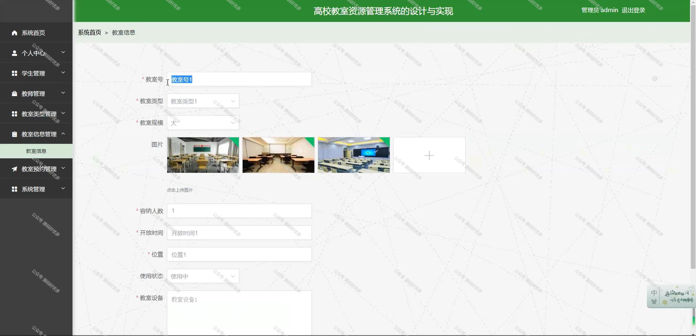
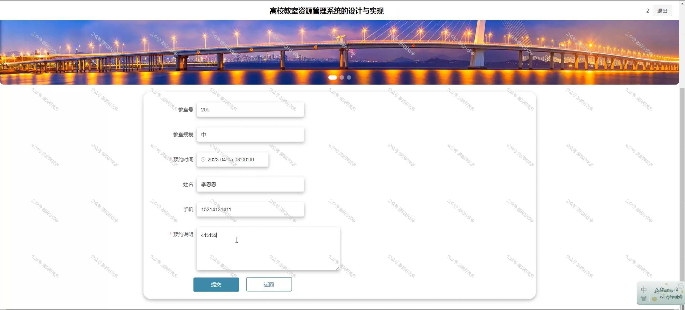

 
## 查看主页获取源码

### 一、作品包含

源码+数据库+全套环境和工具资源+部署教程

### 二、项目技术

前端技术：Html、Css、Js、Vue、Element-ui

数据库：MySQL

后端技术：Java、Spring Boot、MyBatis

  

### 三、运行环境

开发工具：IDEA/eclipse

数据库：MySQL5.7

数据库管理工具：Navicat10以上版本

环境配置软件： JDK1.8+Maven3.6.3

前端Nodejs：14

### 四、项目介绍
项目编号：springbootA165

高校教室资源管理系统的背景在于解决高校教室资源配置和使用中的效率低下、信息不对称等问题。随着高等教育规模的不断扩大，教室资源的需求日益增长，而传统的教室管理模式难以满足灵活多变的教学需求，导致资源利用率不高。因此，开发一套高效、智能的教室资源管理系统，对于优化教室资源配置、提高教学管理效率、促进教育教学改革具有重要作用。

前台学生功能：登录注册、首页、教室信息、系统公告和个人中心。

后台分为管理员和学生
管理员的功能：系统首页、个人中心、学生管理、教师管理、教室类型管理、教室信息管理、教室预约管理、系统管理。
学生的功能：系统首页、个人中心、教室预约管理。

### 五、运行截图

  
